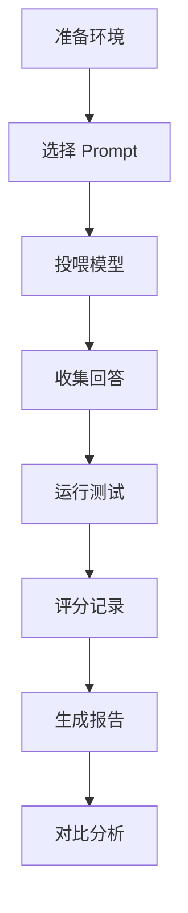

# 🎯 Playwright MCP 大模型评测项目

## 项目概述

这是一个基于 **Playwright MCP** 的大模型能力评测项目，专门用于评估各大模型在**浏览器自动化**场景下的综合能力。

---

## 📁 项目结构

```
llm-evaluation/
├── README.md                      # 使用指南（必读）
├── prompts.md                     # 评测用 Prompts
├── evaluation-framework.md        # 评测框架详细说明
├── evaluation-results.xlsx.md     # 评分记录表
├── auto-test.spec.ts              # 自动化测试脚本
└── PROJECT-INDEX.md               # 本文件（项目索引）
```

---

## 🚀 快速开始

### 3 分钟上手指南

#### Step 1: 打开 Prompts 文件
```bash
# 打开 prompts 文件
cat llm-evaluation/prompts.md
```

#### Step 2: 投喂给模型
复制 **Prompt 1** 或 **Prompt 2** 投喂给待评测的大模型

#### Step 3: 收集回答
- 保存模型生成的代码
- 记录模型的完整回答

#### Step 4: 运行测试
```bash
# 运行自动化测试验证代码
npx playwright test llm-evaluation/auto-test.spec.ts
```

#### Step 5: 评分
打开 `evaluation-results.xlsx.md` 填写评分

---

## 📊 评测维度

### 6 大核心维度

1. **用户体验满意度** (20%)
   - 代码可执行性
   - 回答清晰度

2. **规划执行反馈** (15%)
   - 步骤规划
   - 执行反馈

3. **理解推理能力 - 代码** (25%)
   - API 使用
   - 代码质量

4. **理解推理能力 - 语言** (15%)
   - 需求理解
   - 指令解读

5. **复杂指令遵循** (15%)
   - 格式遵循
   - 约束遵守

6. **工程完备度** (10%)
   - 代码完整性
   - 错误处理

---

## 🔍 问题类型

### 11 类常见问题

| 问题 | 说明 |
|------|------|
| 幻觉 | 编造不存在的 API |
| 上下文丢失 | 忘记之前的内容 |
| 指令遵循失效 | 没按要求做 |
| 死循环 | 重复相同操作 |
| 偷懒 | 省略关键代码 |
| 代码 Bug | 语法/逻辑错误 |
| 废话过多 | 无用内容多 |
| 输出中断 | 回答不完整 |
| 目标漂移 | 偏离任务 |
| 分心 | 关注次要问题 |
| 其他 | 未归类问题 |

---

## 📝 评测文件说明

### 1. README.md - 使用指南
**用途**: 详细的使用说明和评分标准  
**包含**:
- 环境准备
- 评测流程
- 评分标准
- 问题定义
- 常见问题

### 2. prompts.md - 评测题目
**用途**: 直接投喂给模型的 Prompt  
**包含**:
- Prompt 1: 基础浏览器自动化
- Prompt 2: 电商购物流程
- 评分快速参考

### 3. evaluation-framework.md - 评测框架
**用途**: 完整的评测体系文档  
**包含**:
- 评测维度详解
- 评分标准
- 问题分类
- 评测流程
- 报告模板

### 4. evaluation-results.xlsx.md - 评分表
**用途**: 记录评测结果  
**包含**:
- 快速评分表
- 详细评测记录
- 问题统计
- 最终排名

### 5. auto-test.spec.ts - 测试脚本
**用途**: 自动化验证模型代码  
**包含**:
- Prompt 1 测试用例（5 个）
- Prompt 2 测试用例（5 个）
- 代码质量检查
- 性能测试

---

## 🎯 使用场景

### 适用场景

✅ **模型选型**: 为项目选择合适的大模型  
✅ **能力评估**: 了解模型在浏览器自动化方面的能力  
✅ **竞品分析**: 对比不同模型的优劣  
✅ **质量监控**: 持续跟踪模型表现  
✅ **改进方向**: 识别模型改进点

### 不适用场景

❌ **性能基准测试**: 不是性能压测工具  
❌ **安全测试**: 不评估安全性  
❌ **单一功能测试**: 评估的是综合能力

---

## 📈 评测流程

### 完整流程



### 简化流程

```
投喂 Prompt → 收集回答 → 运行验证 → 评分 → 下一个
```

---

## 🏆 评级标准

| 等级 | 分数 | 说明 | 推荐用途 |
|------|------|------|----------|
| **S** | 90-100 | 优秀 | 生产环境 |
| **A** | 80-89 | 良好 | 重要项目 |
| **B** | 70-79 | 中等 | 一般任务 |
| **C** | 60-69 | 及格 | 简单任务 |
| **D** | <60 | 不及格 | 不推荐 |

---

## 📋 评分表模板

### 快速评分表

| 模型 | P1 得分 | P2 得分 | 平均分 | 评级 |
|------|---------|---------|--------|------|
| Model-1 | _/100 | _/100 | _/100 | _ |
| Model-2 | _/100 | _/100 | _/100 | _ |
| Model-3 | _/100 | _/100 | _/100 | _ |

---

## 🔧 工具依赖

### 必需工具

- **Node.js**: >= 18
- **Playwright**: 1.59.0-next
- **浏览器**: Chromium（默认）

### 可选工具

- **VS Code**: 代码编辑
- **Excel**: 评分记录（可选）
- **截图工具**: 记录输出

---

## 💡 最佳实践

### 1. 环境准备
```bash
# 安装依赖
npm install

# 安装浏览器
npx playwright install chromium
```

### 2. 公平测试
- 使用相同的 Prompt
- 使用相同的环境
- 等待完整回答

### 3. 客观评分
- 按照评分标准
- 记录具体问题
- 保存测试证据

### 4. 结果分析
- 统计问题分布
- 识别常见问题
- 生成对比报告

---

## 📊 输出成果

### 评测报告包含

1. **综合排名**: 各模型平均分
2. **维度分析**: 各维度最佳模型
3. **问题统计**: 问题类型分布
4. **代码通过率**: 实际运行结果
5. **改进建议**: 针对各模型的建议

### 示例报告

```
最佳整体表现：Model-3 (92 分)
最佳代码质量：Model-1 (95 分)
最佳指令遵循：Model-2 (93 分)
最少问题：Model-3 (2 个问题)
```

---

## ⚠️ 注意事项

### 必须遵守

✅ **公平性**: 所有模型相同条件  
✅ **客观性**: 按标准评分  
✅ **完整性**: 记录所有问题  
✅ **可追溯**: 保存测试记录

### 避免事项

❌ **主观偏见**: 不要凭喜好评分  
❌ **选择性记录**: 不要只记录好的  
❌ **环境差异**: 不要改变测试环境  
❌ **中途修改**: 不要修改 Prompt

---

## 🎓 学习资源

### 相关文档

- [Playwright 官方文档](https://playwright.dev)
- [MCP 协议文档](https://modelcontextprotocol.io)
- [评测框架文档](./evaluation-framework.md)

### 视频教程

- Playwright 入门
- MCP 使用指南
- 大模型评测方法

---

## 📞 支持与反馈

### 遇到问题？

1. 查看 [README.md](./README.md)
2. 查看 [evaluation-framework.md](./evaluation-framework.md)
3. 检查测试环境配置

### 改进建议

欢迎提交：
- 评分标准优化
- 新的测试场景
- 问题类型补充

---

## 📝 版本历史

| 版本 | 日期 | 更新内容 |
|------|------|----------|
| 1.0 | 2026-03-20 | 初始版本 |

---

## 🎯 项目目标

通过本评测项目，帮助您：

✅ **快速评估** 各大模型在浏览器自动化场景的能力  
✅ **量化对比** 不同模型的优劣  
✅ **科学选型** 为项目选择合适模型  
✅ **持续改进** 识别模型改进方向  

---

## 🚀 开始评测

```bash
# 1. 查看使用指南
cat README.md

# 2. 获取 Prompts
cat prompts.md

# 3. 开始评测
# 投喂 Prompt → 收集回答 → 运行测试 → 评分
```

---

**祝评测顺利！** 🎉

---

**项目维护**: 评测团队  
**最后更新**: 2026-03-20  
**联系方式**: evaluation-team@example.com
